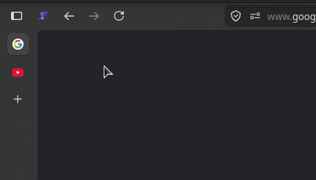

# Houdini

Houdini brings Opera GX tab workspaces straight into Firefox's own sidebar.
Pick a panel and every tab that doesn't belong disappears.

Houdini would approve 🎩

<p align="center">
  
</p>

<p align="center"></p>

---

## What it does

A **panel** is a named group of tabs. Only one panel is visible at a time: switch to it and let Houdini
**make its tabs appear** and **make every other tab disappear**.
Hidden tabs aren't closed — they keep their state and reappear the moment you switch back. Tag a tab once and it stays with its panel across restarts.

**N.B.:** Houdini uses no custom sidebar and no replacement tab strip. Just Firefox's native tab bar.

---

## Features

| Feature | What it gives you |
| --- | --- |
| **Panels** | Group tabs into named, icon-tagged panels. Switch to focus one; the rest hide. |
| **Toolbar popup** | Add, rename, reorder, remove and switch panels from one click. |
| **Cross-panel search** | Find a tab in _any_ panel by title or URL; jump to it and Houdini switches panels for you. |
| **Keyboard shortcuts** | Cycle or jump to panels from the keyboard; remap keys in Settings. |
| **Sub-panel tab grouping** | Optionally drop tabs you open from a link into their opener's native Firefox tab group. |
| **Automatic snapshots** | Periodic backups of your panels + tab assignments, with one-click rollback. |
| **Backup & restore** | Export your panels + tab assignments to a file; re-import on another machine. |
| **Sidebery import** | Migrate your existing Sidebery panels and tab grouping. |

### Panels & switching

Open the toolbar popup to see every panel with its live tab count. Click **Open** to switch — the active panel is outlined.
Add, remove, or rename panel; pick an icon from the palette, reorder with the arrows.

### Cross-panel tab search

The search bar at the top of the popup filters every open tab — across _any_ panel — by title or URL. Each
result shows which panel it belongs to. Click it and Houdini switches to that panel and focuses the tab.

### Keyboard shortcuts

Switch panels without touching the mouse. Defaults:

| Shortcut | Action |
| --- | --- |
| <kbd>Alt</kbd>+<kbd>.</kbd> | Next panel |
| <kbd>Alt</kbd>+<kbd>,</kbd> | Previous panel |
| <kbd>Alt</kbd>+<kbd>P</kbd> | Open the Houdini popup |
| _unset_ | Jump straight to panel 1–8 |

Remap any of them — or assign the panel-jump keys — right from **Settings → Keyboard shortcuts**:
click **Set**, press your combo (needs <kbd>Ctrl</kbd> or <kbd>Alt</kbd>), done. No `about:addons` detour.

### Sub-panel tab grouping

Off by default. When enabled (**Settings → Tab grouping**), any tab you open _from_ another — a link in
a new tab, "open in new tab" — joins its opener's **native Firefox tab group**. If the opener isn't
grouped yet, Houdini starts a group from the pair. Grouping is one level deep: a sub-tab simply adopts
its opener's group, so a whole chain of links lands in the same group rather than nesting.

Needs a Firefox version with the tab-groups API — the toggle disables itself and says so if yours
doesn't have it.

### Automatic snapshots & rollback

Houdini periodically saves a snapshot of your panels and which tab belongs where. Open **Settings** to:

- set the snapshot **period** (in hours),
- set the **maximum number** of snapshots to keep (older ones are pruned),
- take a snapshot **on demand**,
- **roll back** to any saved snapshot, or delete ones you don't need.

Rolling back restores the panel list and re-tags your tabs to match the snapshot — reopening tabs that were
since closed and closing ones opened afterward, so the window matches that point in time.

Snapshots use Firefox alarms, so the schedule survives browser restarts: if Firefox was closed when a
snapshot was due, it runs on next launch.

### Backup & restore

Snapshots live inside the browser profile — fine for quick rollbacks, gone if the profile is. For a
portable copy, **Settings → Backup & restore → Export** saves your panels and tab assignments to a
`houdini-backup-YYYY-MM-DD.json` file. **Import** it (file or pasted JSON) on another machine or after a
reinstall to recreate the exact same setup.

> ⚠️ Restoring is destructive — it replaces all current panels and re-tags every open tab, just like a
> rollback. You'll be asked to confirm.

---

## Installation

Install from the Firefox Add-ons store: [**Houdini**](https://addons.mozilla.org/en-US/firefox/addon/houdini/)

---

## Importing from Sidebery

Switching from [Sidebery](https://addons.mozilla.org/firefox/addon/sidebery/)? Houdini can recreate your
panels and re-tag your open tabs to match.

Open **Settings** (from the popup) → **Import from Sidebery**. You can either pick a Sidebery backup file
or paste the dump JSON. Both **replace** your current Houdini panels and re-tag every open tab.

> ⚠️ Import is destructive — it replaces all existing Houdini panels and tab assignments. You'll be asked
> to confirm.

### Getting your Sidebery data

A panels-only Sidebery backup recreates the panels but tags no tabs. To also re-tag your open tabs, grab a
full storage dump:

1. Go to `about:debugging` → **This Firefox**.
2. Find **Sidebery** in the list → click **Inspect**.
3. Open the **Console** tab.
4. Paste and run:

   ```js
   (async () => {
     const d = await browser.storage.local.get(['sidebar','tabsDataCache','snapshots','ver']);
     copy(JSON.stringify(d));
     console.log('Copied to clipboard — paste into Houdini.');
   })();
   ```

5. The JSON is now on your clipboard. Paste it into the **Import from Sidebery** box in Houdini's Settings
   and click **Import pasted JSON**.

Houdini reads Sidebery's open-tab cache (`tabsDataCache`) to match each tab's URL to its panel; tabs whose
URL it can't match land in the first panel.

---

## Resetting

Need a clean slate? **Settings → Reset** collapses everything to a single default panel and moves **all**
tabs into it. Like import, it's destructive and asks for confirmation.

---

## Permissions

| Permission | Why |
| --- | --- |
| `tabs`, `tabHide` | Read tabs and show/hide them per panel. |
| `sessions` | Tag each tab with its panel, persisting across restarts. |
| `storage` | Store panels, settings and snapshots. |
| `alarms` | Schedule automatic snapshots that survive restarts. |
| `menus` | Add the "Move to panel" tab right-click entry. |
| `tabGroups` | Put sub-tabs into native tab groups (when grouping is enabled). |

Houdini collects no data and talks to no server — everything stays in your browser.

---

## License

See [LICENSE](LICENSE).
